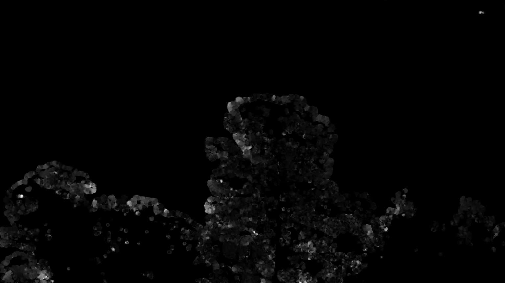

# Gone-with-the-Wind

Wind Motion from Video
 
Basic example of using calculating Farneback optical flow to detect wind speed (and direction in the future) from videos of swaying trees.

Screenshot of grayscale optical flow:

Example output is under `09022021_183552`. Includes raw output and images:

        1. Mean Optical Flow  & Wind Speed over Time
        

        2. Mean Optical Flow vs Wind Speed
        

In `video_gradient_example.py`, update the config to match the video and wind measurement paths and run it.
Then, `basic_predictor.py` to plot results and compute correlation. 